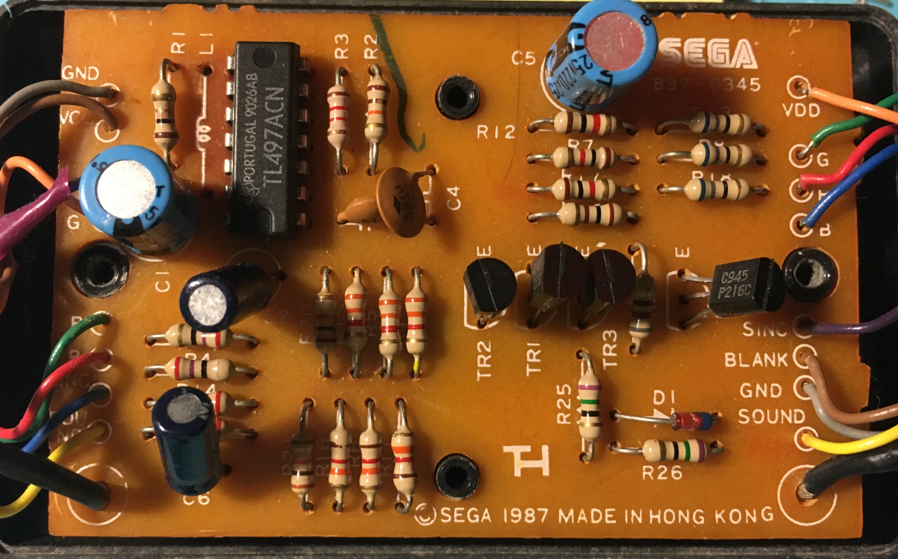
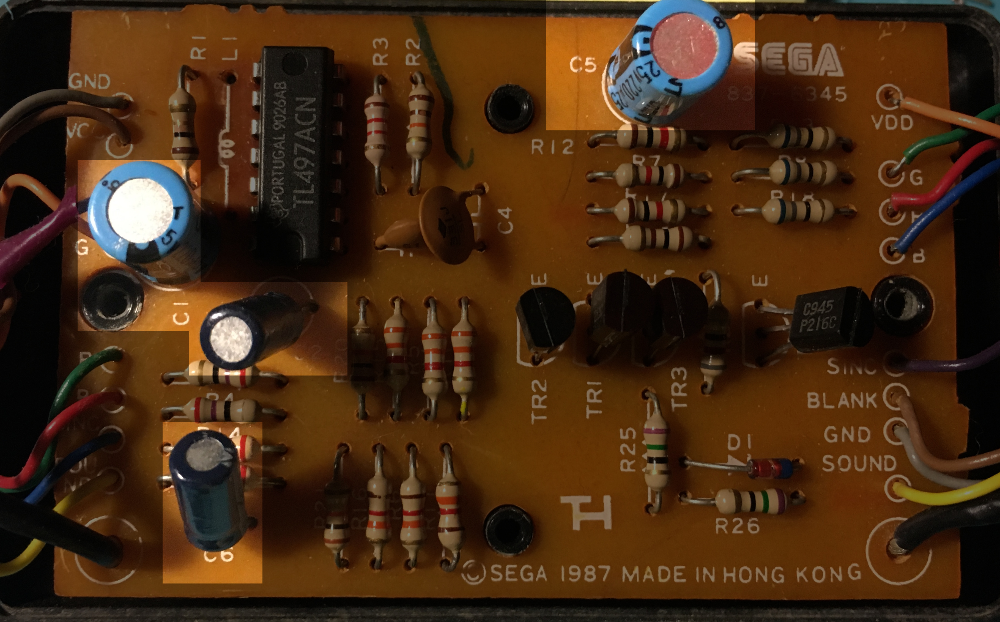

# megadrive-adaptateur-rvb-specs
Technical information about the RGB adapter ("Adaptateur R.V.B.") shipped
with French Mega Drives.

## External documentation

- [Using the RVB adapter for NTSC output (French)](http://www.segakore.fr/index.php/2004/08/07/mega-drive-modifiez-votre-cable-rgb-fr-vers-pal-ntsc)
- [Sega RGB cable](https://segaretro.org/Sega_Master_System#Sega_RGB_Cable)

## Board

## Capacitors replacement

Capacitor | Values | Form factor
------------ | ------------- | -------------
C1 | 220 µF 25V | radial
C2 | 100 µF 10V | radial
C5 | 220 µF 25V | radial
C6 | 10 µF 16V | radial

## License

See [license file](LICENSE)
